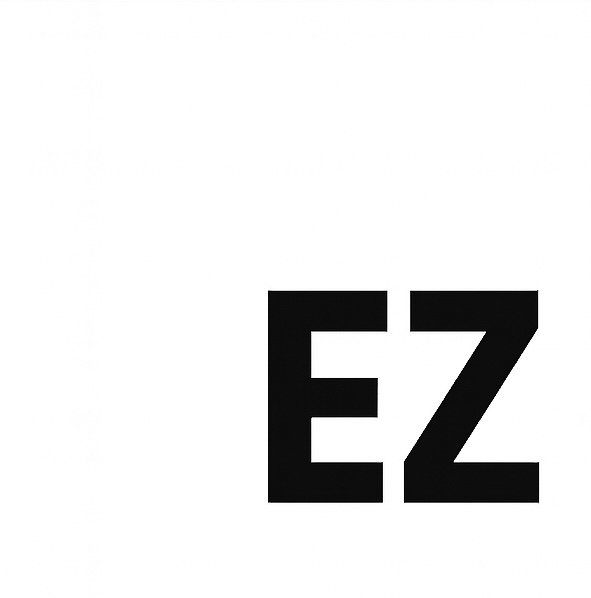

<p align="center">
  
</p>

<p align="center">
  A statically typed, compiled programming language.
</p>

<h3 align="center">Programming made EZ.</h3>

<p align="center">
  <a href="https://schoolyb.github.io/EZ-Language-Webapp/docs">Learn More About EZ</a>
</p>

<p align="center">
  <a href="https://github.com/SchoolyB/EZ/actions/workflows/ci.yml"></a>
  <a href="https://github.com/SchoolyB/EZ/actions/workflows/codeql-analysis.yml"></a>
</p>

---

## What is EZ

EZ is a statically typed, compiled programming language that produces native binaries. Source files (`.ez`) are compiled to C, then to machine code. The result is a single binary with no runtime dependencies.

- Static type system with type inference
- Structs with scoped functions
- Multi-return values and error handling
- String interpolation, enums, when/is expressions
- 26 standard library modules (HTTP, JSON, crypto, SQLite, threads, and more)
- Compiles in milliseconds


```ez
import @json, @arrays

#json
const Task struct {
    title string
    priority int
    done bool
}

do urgent(tasks [Task]) -> (result [Task], count int) {
    mut result [Task] = {}
    mut count int = 0

    for_each t in tasks {
        when t.priority {
            is 1, 2 {
                if !t.done {
                    arrays.append(result, t)
                    count += 1
                }
            }
        }
    }

    return result, count
}

do main() {
    mut tasks [Task] = {
        Task{title: "Fix login bug", priority: 1, done: false},
        Task{title: "Write tests", priority: 2, done: false},
        Task{title: "Update docs", priority: 3, done: true},
        Task{title: "Deploy v3", priority: 1, done: true},
        Task{title: "Review PRs", priority: 2, done: false}
    }

    mut pending, total = urgent(tasks)

    println("${total} urgent tasks:")
    for_each t in pending {
        println("  [!] ${t.title}")
    }

    println("\nExported as JSON:")
    for_each t in pending {
        println(json.stringify(t))
    }
}
```

---

## Install

### Binary download (recommended)

Download the latest release for your platform from the [Releases page](https://github.com/SchoolyB/EZ/releases). No dependencies required.

### Build from source

Requires Go 1.23+ and a C compiler (gcc or clang).

```bash
git clone https://github.com/SchoolyB/EZ.git
cd EZ
make build
make install
```

> **Note:** EZ currently supports **macOS** and **Linux** only.

---

## Quick Start

Create a file called `main.ez`:

```ez
do main() {
    println("Hello, World!")
}
```

Run it:

```bash
ez main.ez
```

EZ compiles your code to a native binary, executes it, and cleans up.

---

## Commands

```
ez <file.ez>              Compile and run
ez build <file.ez> -o app Compile to a distributable binary
ez check <file.ez>        Type check without compiling
ez repl                   Interactive REPL
ez watch <file.ez>        Watch for changes, re-run on save
ez doc <file.ez>           Generate docs from #doc attributes
ez pz <name>             Scaffold a new project
ez test                   Run the full test suite
ez report                 Print system info for bug reports
ez update                 Update to the latest stable version
ez update --pre           Update to the latest pre-release (alpha/beta/rc)
ez install <version>      Install a specific version (e.g. 2.5.0, 3.0.0-beta.2)
ez version                Show version info
```

---

## Updating

```bash
ez update              # latest stable
ez update --pre        # latest pre-release
ez install 2.5.0       # pin to an exact version
```

`ez update` checks for new versions, shows the changelog, and upgrades both the `ez` CLI and the compiler. Pass `--pre` to pick up the latest alpha, beta, or rc. Use `ez install <version>` to install an exact version by semver — downgrades and pre-release tags (e.g. `3.0.0-beta.2`) are supported.

---

## Bug Reports

Found a bug? Run `ez report` to gather your system info, then open an issue at [github.com/SchoolyB/EZ/issues](https://github.com/SchoolyB/EZ/issues) and paste the output:

```bash
ez report
```

```
EZ Bug Report Info
======================
EZ Version:  v3.0.0-alpha.13  (pre-release)
Commit:      (released build)
Install:     /usr/local/bin/ez
OS:          darwin/arm64  Darwin 24.5.0
CPU:         Apple M2
RAM:         8 GB
C compiler:  /usr/bin/clang
             Apple clang version 17.0.0 (clang-1700.0.13.5)
             target: arm64-apple-darwin24.5.0
```

Include this output along with a description of the bug, the EZ code that triggers it, and what you expected to happen.

---

## Learn More

- [Official documentation](https://schoolyb.github.io/EZ-Language-Webapp/docs)
- [Contributing guide](CONTRIBUTING.md)

---

## License

MIT License - Copyright (c) 2025-Present Marshall A Burns

See [LICENSE](LICENSE) for details.

---

## Contributors

Thank you to everyone who has contributed to EZ!

<a href="https://github.com/akamikado"></a>
<a href="https://github.com/CobbCoding1"></a>
<a href="https://github.com/CFFinch62"></a>
<a href="https://github.com/Aryan-Shrivastva"></a>
<a href="https://github.com/arjunpathak072"></a>
<a href="https://github.com/deepika1214"></a>
<a href="https://github.com/blackgirlbytes"></a>
<a href="https://github.com/majiayu000"></a>
<a href="https://github.com/prjctimg"></a>
<a href="https://github.com/jaideepkathiresan"></a>
<a href="https://github.com/Abhishek022001"></a>
<a href="https://github.com/Scanf-s"></a>
<a href="https://github.com/HCH1212"></a>
<a href="https://github.com/elect0"></a>
<a href="https://github.com/jgafnea"></a>
<a href="https://github.com/madhav-murali"></a>
<a href="https://github.com/preettrank53"></a>
<a href="https://github.com/TechLateef"></a>
<a href="https://github.com/dtee1"></a>
<a href="https://github.com/SAY-5"></a>
